 
  
 # ****

## [Link para pagina web *Art Space*](https://fabianesantos.github.io/SCL014-social-network/src/index.html#/inicio-sesion)

## **Índice**

* [1. Resumen del proyecto](#1-resumen-del-proyecto)
* [2. Resumen del producto](#2-resumen-del-producto)
* [3. Planificación](#3-planificacion)
* [4. Proceso UX/ UI](#4-proceso-de-ux)
* [5. Feedback](#5-feedback)
* [6. Pagina web Finalizada](#7-checklist)

### **1. Resumen del proyecto**

En este proyecto construirás una Red Social sobre lo que decidan tú y tu equipo. Tu Red Social tendrá que permitir a cualquier usuario crear una cuenta de acceso y loguearse con ella; crear, editar, borrar y "likear" publicacciones.
### **2. Resumen del producto**

**Art Space** es una página web donde podrás tener acceso a la mejor comunidad de artes manuales!!! Regístrate y tendrás informaciones de eventos, charlar con otros participantes y mostrar toda tu arte!

### **3. Planificación**

Empezamos a planificar todo lo que seria necesario para el desarrollo de la página web utilizando el **Trello**, donde nos permitió una mejor visualización de todas las etapas necesarias, y dividimos las tareas por sprint.

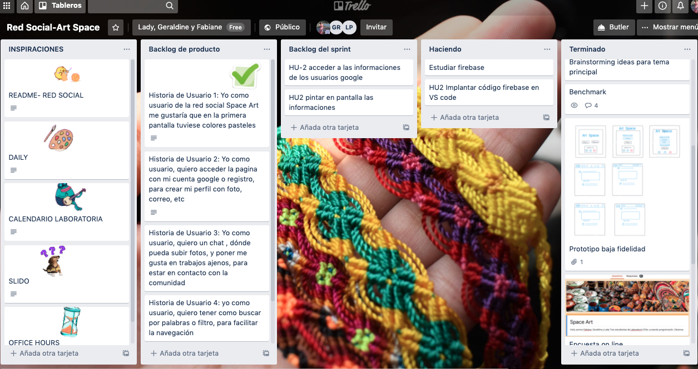

### **4. Proceso UX/ UI**

 Basado en ideas de las colaboradoras, creamos nuestro sketch, hecho en papel y lapis.

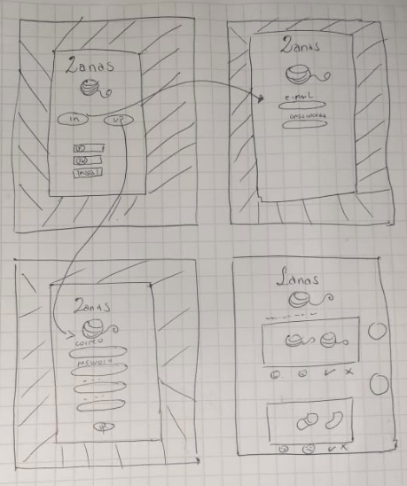

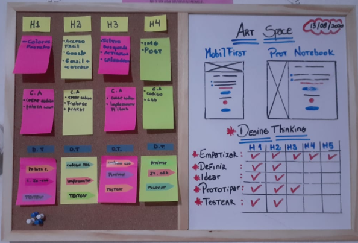

 ##### Definición de usuario

 Desarrollar una red social para los amantes y personas interesadas en conocer más de las artes manuales

##### Encuesta On line

Fue realizada una encuesta on line con 51 usuarios, donde los usuarios contestaron algunas preguntas sobre artes, y las seguientes imagenes muestran el resultado:
 
 [Link encuesta](https://forms.gle/Jvd9dt2jZp2uJVbT7)

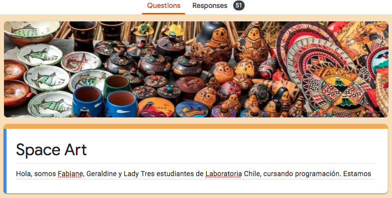
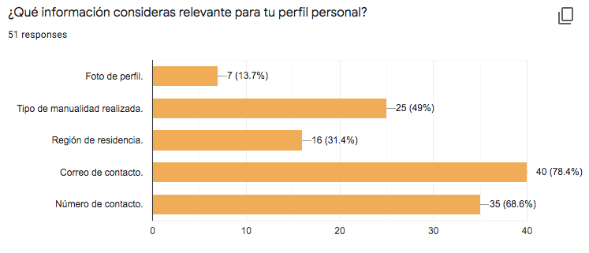
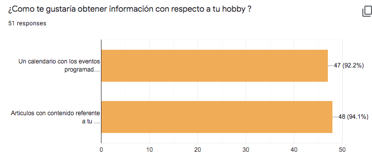
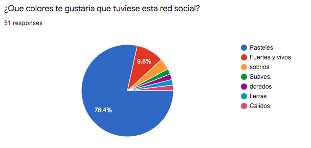
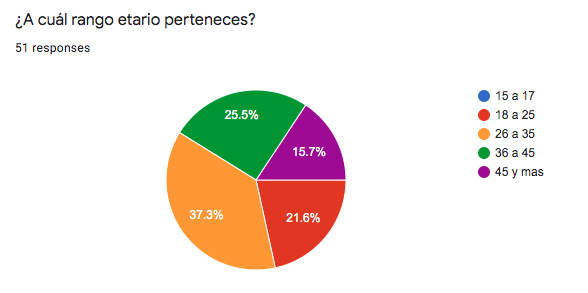

##### Historias de Usuarios

Historia de Usuario 1: Yo como usuario de la red social Space Art me gustaría que en la primera pantalla tuviese colores pasteles.

Historia de Usuario 2: Yo como usuario, quiero acceder la pagina con mi cuenta google o registro, para entrar con más facilidad en la red social .

Historia de Usuario 3: Yo como usuario, quiero un chat , para escribir mensajes, con mi nombre y fecha para estar en contacto con la comunidad.

Historia de Usuario 4: Yo como usuario, quiero mirar los eventos en un calendario y mirar artículos sobre artesania, para actualizarme.

Historia de Usuario 5: Yo como usuario, quiero un chat , dónde pueda subir fotos, y poner me gusta en trabajos ajenos, para estar en contacto con la comunidad.

##### Prototipos

Prototipo de baja fidelidad, con la App **Invision**

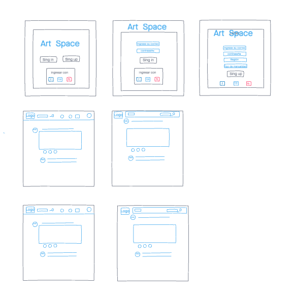

Prototipo de alta fidelidad, hechos con **Figma** 

[Link para prototipo alta fidelidad Mobile](https://www.figma.com/proto/glEilOzjC5zxt7sToRUXQ7/Untitled?node-id=43%3A1&scaling=min-zoom) 

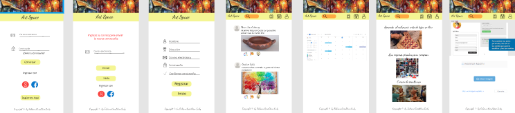

[Link para prototipo alta fidelidad Desktop](https://www.figma.com/proto/glEilOzjC5zxt7sToRUXQ7/Untitled?node-id=21%3A4&scaling=min-zoom)

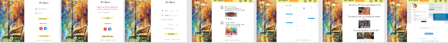

##### Teste de Usuario

El prototipo de alta fidelidad fue testado por 5 personas, donde constatamos que:

- Hacer cambios en el tipo de letra,
- Mejoras en pagina del muro.

### **5. Feedbacks**  

##### Feedback de compañeros:

Con el sketcher en manos, nos reunimos con otros compañeros y recibimos un primer **feedback**, donde constatamos que debíamos enfocarnos en crear algo sencillo y funcional.

##### Feedback de coaches:

En nuestro  feedback, hecho con los coaches, percibimos la necesidad de cambiar algunos puntos de nuestra página web, mejorando así los colores, letras. Nos ayudaron a mejorar nuestro codigo, dejandolo más dinamico.

### **6. Pagina web Finalizada**

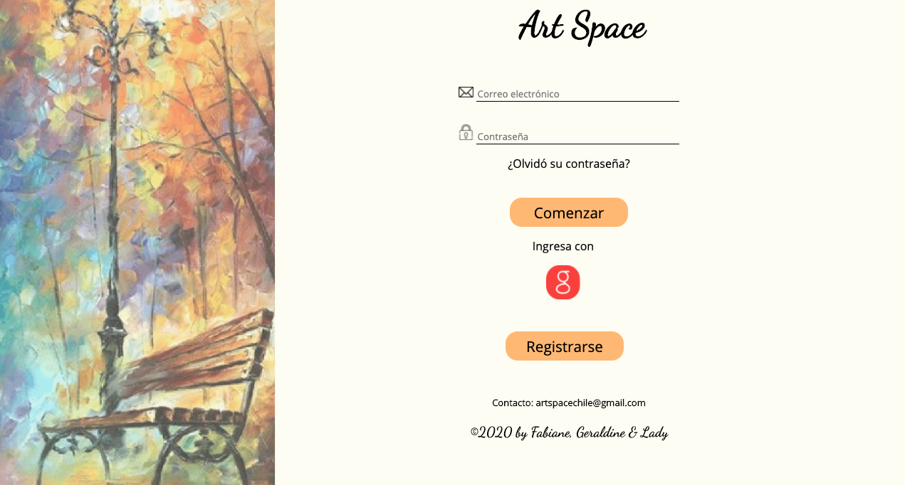

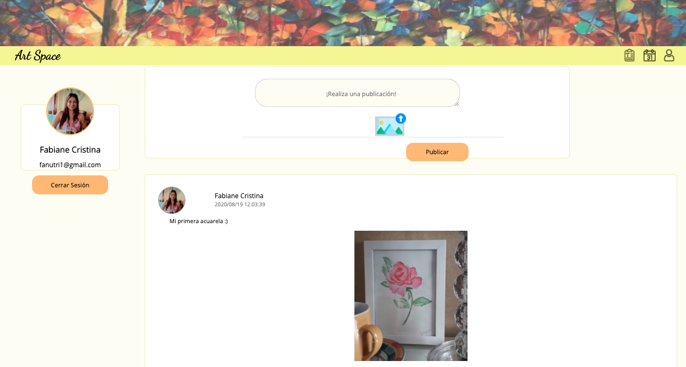

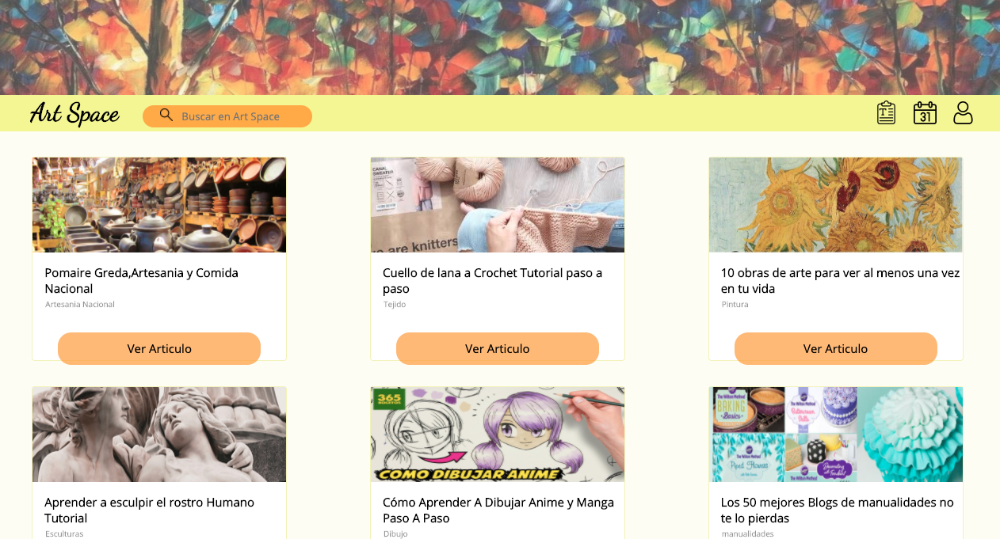

## Autor@s:

  [Lady Pino](https://github.com/Ladypino?tab=repositories)
  
  
  [Geraldine Villacura Ruz](https://github.com/gvillacura?tab=repositories)

  [Fabiane Santos](https://github.com/FabianeSantos?tab=repositories)
  
